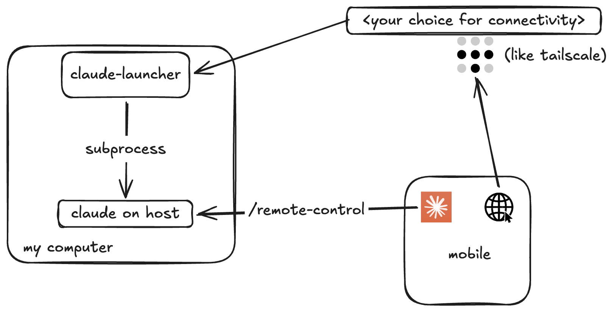

# claude-launcher

A small web UI that spawns **remote-controlled Claude Code sessions** in a
directory + shell of your choice, and lists/kills them. You drive the sessions
themselves from <https://claude.ai/code> or the mobile **Code** tab.

One static Go binary — the htmx UI is embedded. macOS/Linux and Windows.



## Run it

```sh
make run                      # or: go run .   → http://localhost:8922/
make build                    # ./claude-launcher
make dist                     # dist/ for darwin, linux, windows
```

Needs **Claude Code ≥ 2.1.51** (tested against 2.1.280) logged in via claude.ai
(`claude`, *not* an `ANTHROPIC_API_KEY`) on a Pro/Max/Team plan — remote
control needs the full OAuth scope. Go ≥ 1.25 to build.

## How it works

Each launch runs, through the chosen shell, in the chosen directory:

```
claude --model "<model>" --remote-control "<name>"
```

Going *through* a shell sources its profile first (PATH, nvm, aliases), so pick
the shell whose config the session should inherit. The model id is always
quoted — some model ids contain shell-special characters (e.g. older
`[1m]`-suffixed context-window variants).

`claude --remote-control` is **interactive**: with a non-TTY stdout it drops to
`--print` mode and exits. So sessions run in a real **pseudo-terminal** (ConPTY
on Windows, forkpty elsewhere), windowless, output captured to
`data/logs/<id>.log` (capped at 256 KB).

On a first launch `claude` can block on onboarding gates — folder trust, Chrome
extension, fullscreen renderer — *before* remote control is up, so nobody can
answer them. The launcher watches the PTY and auto-answers each known gate once
(`startupPrompts` in `internal/sessions/sessions.go`).

Sessions are tracked **in memory** and owned by the launcher process: restart it
and you relaunch them.

## Configuration

- **`.env`** — per-machine wiring: port, node id, data dir. See `.env.example`.
- **`config.yaml`** — the catalog: models offered, shells known. Optional;
  built-in defaults apply otherwise.

```sh
claude-launcher --dump-config > config.yaml    # start from the defaults
```

A `config.yaml` **replaces** the defaults wholesale, so you can drop models you
never use. It is re-read when it changes — no restart, which matters because a
restart kills every live session. Invalid files are ignored, last good wins.

## The ring (multi-host)

One UI can drive launchers on several machines. Membership is static and
hand-maintained — no election, no discovery. Each node is the sole authority for
its own sessions; the leader queries on demand (`/api/sessions` fans out and
unions) and forwards mutations (`?node=<id>` proxies verbatim).

```sh
# leader                              # follower
CLAUDE_LAUNCHER_ROLE=leader           CLAUDE_LAUNCHER_ROLE=follower
CLAUDE_LAUNCHER_NODE_ID=laptop        CLAUDE_LAUNCHER_NODE_ID=desktop
CLAUDE_LAUNCHER_FOLLOWERS=desktop|Desktop|http://desktop.ts.net:8922
```

With one node the host picker stays hidden.

## Security

**There is no auth.** Anyone who reaches the port can spawn a shell on the host.
Bind it to a private network — a tailnet, a VPN, localhost. Never the internet.

## API

`GET /healthz` · `/api/nodes` · `/api/shells` · `/api/models` · `/api/config` ·
`/api/browse?path=` · `POST /api/mkdir` · `GET|POST /api/sessions` ·
`GET|DELETE /api/sessions/{id}` · `GET /api/sessions/{id}/log`

Host-specific routes take `?node=<id>`. `/ui/*` serves the htmx fragments.

`GET /api/sessions?running=1` drops stopped rows. A stopped session stays
listed for 10 minutes so you can see how it ended, then is swept from memory.

## Turns — submitting work to a session over the API

A session id is a **UUID**, and it is also the id `claude` itself uses: the
launcher passes it as `--session-id` at spawn. That makes a session
addressable, so any caller — typically another Claude Code instance on another
machine — can hand it a prompt and collect the answer.

```sh
# 1. find a session (no ?node= needed: the leader resolves the owner)
curl -s localhost:8922/api/sessions?running=1

# 2. submit a turn → 202 with a turn id
curl -s -XPOST localhost:8922/api/sessions/$SID/turns \
     -d '{"prompt":"run the iOS build and report failures"}'

# 3. long-poll for the result (up to 60s per call; repeat until state != running)
curl -s "localhost:8922/api/sessions/$SID/turns/$TID?wait=60"
```

| Route | |
|---|---|
| `POST /api/sessions/{id}/turns` | body `{prompt, permissionMode?, timeoutSec?, maxBudgetUsd?}` → `202` turn |
| `GET /api/sessions/{id}/turns/{tid}?wait=30` | `200` turn; long-polls up to `wait` seconds (cap 60) |
| `GET /api/sessions/{id}/turns` | `200` turns, newest first (last 20 plus any in flight) |
| `DELETE /api/sessions/{id}/turns/{tid}` | `200` turn `state:"killed"`; `409` if it already finished |

A turn ends in `state` `done`, `error`, `timeout` or `killed`. `done` carries
`result`, `numTurns`, `durationMs`, `costUsd`; the others carry `error`.

Rejections are explicit, so a caller never has to guess:

| | |
|---|---|
| `409` `state:"busy"` | a turn is already running; the body carries it, so poll that instead. **Turns are never queued** — a queued prompt would run against context the caller couldn't see |
| `409` `state:"starting"` | the session hasn't finished coming up |
| `409` `remoteStatus` | a human appears to be driving the session right now (advisory) |
| `410` `state:"stopped"` | the session is dead; stop retrying |

All four carry `Retry-After` where retrying makes sense.

### How it works, and what that costs you

A turn does **not** type into the session's terminal. The launcher runs a
separate, short-lived `claude -p --resume <id> --output-format json` process in
the session's directory, with the prompt on stdin. Verified against claude
2.1.280: this works while the interactive `--remote-control` process is live
and connected, appends linearly to the same transcript, and leaves that process
healthy.

Two things to know:

- **The live TUI does not refresh** to show an API-submitted turn — it's a
  separate process and doesn't watch the transcript file. Resume or restart the
  session to see it. The turn itself *does* see everything already in the
  transcript.
- A human typing into the TUI at the *same instant* an API turn runs has not
  been verified. Nothing can corrupt on the launcher's side (it never writes to
  the terminal, and one session runs at most one API turn at a time), but the
  interleaving in claude's own transcript is untested.

`CLAUDE_LAUNCHER_TURN_TIMEOUT` (default `15m`) bounds a turn; `timeoutSec` in
the request overrides it, capped at 60 minutes.
